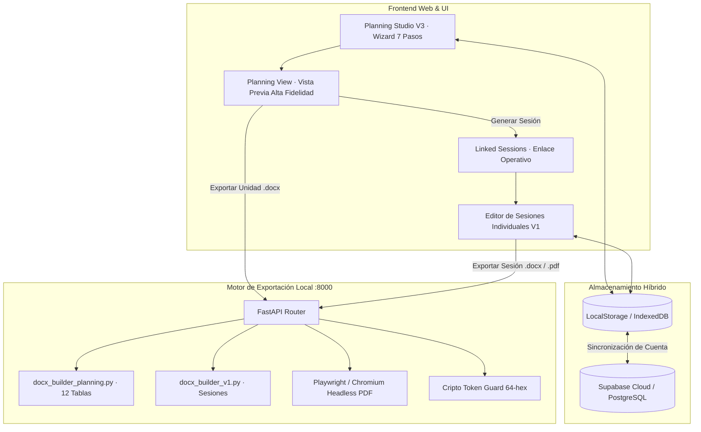

# REPORTE TÉCNICO MAESTRO: SPACE LAB — SESIONES EDUCATIVAS CON IA
**Plataforma Integral de Planificación Curricular y Generación Documental (MINEDU / CNEB Perú)**

---

### Ficha Técnica del Proyecto
* **Nombre Oficial**: Space Lab — Sesiones Educativas con IA
* **Propietario / Autor**: S.Y. PABLITO_DP (`dppablito4-oss`)
* **Repositorio Principal**: [`dppablito4-oss/space-lab-sesiones-educ`](https://github.com/dppablito4-oss/space-lab-sesiones-educ)
* **Rama Activa**: `main` (sincronizada en commit [`84ef11b`](https://github.com/dppablito4-oss/space-lab-sesiones-educ/commit/84ef11b22dfdd6968eef791bdc3757476fbb97a7))
* **Servidores Locales Operativos**:
  * **Frontend Web**: `http://127.0.0.1:8080` (Vanilla JS / CSS Tokens V3)
  * **Backend Exportador**: `http://127.0.0.1:8000` (FastAPI + Python DOCX Engine)
* **Plataforma en Producción**: [https://sesiones.sypablitodp.site](https://sesiones.sypablitodp.site)
* **Portal de Descargas**: [https://descargas.sypablitodp.site](https://descargas.sypablitodp.site)
* **Fecha de Emisión**: Octubre de 2026
* **Marco Normativo Nacional**:
  * Currículo Nacional de la Educación Básica (CNEB - R.M. 649-2016-MINEDU)
  * Norma Técnica de Evaluación Formativa (R.V.M. 094-2020-MINEDU)
  * Modelo de Servicio Educativo Jornada Escolar Completa (JEC) y EBR Secundaria

---

## 1. Arquitectura General del Sistema

Space Lab opera bajo una arquitectura desacoplada y orientada a la soberanía de datos del docente:

---

## 2. Inventario de Capacidades: ¿Qué puede hacer la aplicación hasta ahora?

### MÓDULO A: Planificación Curricular V3 (Planning Studio)
1. **Gestión de Unidades Didácticas, Proyectos y Experiencias de Aprendizaje**:
   * Soporte canónico para el estándar `PlanningContainer 2.0`.
   * Wizard asistido paso a paso adaptado a las exigencias de Educación Secundaria:
     * **Paso 0 (Datos y Contexto)**: I.E., Director(a), Coordinador(a) Pedagógico(a) JEC, Docente Responsable, DRE, UGEL, Grado (1.° a 5.°), Ciclo automático (VI o VII), Secciones y Duración.
     * **Paso 1 (Situación Significativa y Tabla Dual)**: Diagnóstico de la comunidad, reto movilizador, pregunta retadora y la **Tabla Dual destacada (Propósito de la Unidad vs. Producto Final Integrador)** idéntica a los formatos oficiales de UGEL.
     * **Paso 2 (Currículo y Criterios)**: Selección de competencias y capacidades oficiales del CNEB, con taxonomía de criterios `C1, C2, C3, C4` y estándares de ciclo.
     * **Paso 3 (Metodología)**: Selección de enfoques activos (Aprendizaje Basado en Proyectos, Problemas, Desafíos o Metodología Propia).
     * **Paso 4 (Producto y Evaluación)**: Descripción del producto final y orientaciones para evaluación formativa.
     * **Paso 5 (Secuencia Didáctica Semanal)**: Secuencia de sesiones organizadas por semanas, hitos, duración, conocimientos (campo temático), evidencias esperadas e instrumentos.
     * **Paso 6 (Revisión y Lifecycle)**: Motor de validación suave y estricta que guía al docente para completar campos requeridos antes de transicionar a estado `reviewed`.
2. **Visualizador Web de Alta Fidelidad ([`js/planning/planning-view.js`](file:///e:/sesiones_educ_ia/js/planning/planning-view.js))**:
   * Acordeones dinámicos para explorar situación significativa, propósitos, producto integrador, matriz curricular y secuencia de sesiones.
   * Botón directo de **"Descargar Word (.docx)"** con renderizado nativo.

---

### MÓDULO B: Motor Nativo DOCX en Python ([`backend/docx_builder_planning.py`](file:///e:/sesiones_educ_ia/backend/docx_builder_planning.py))
Genera documentos oficiales con calidad tipográfica y de imprenta:
* **Formato de Hoja A4**: Medidas oficiales de `210.1 mm × 296.9 mm` con márgenes de `0.75 in` (1,080 twips / 1.91 cm).
* **Cuadrícula Institucional de 10,490 twips**:
  * Ancho total de tabla: `10,490 twips` (7.28 in / 18.50 cm).
  * Sangría izquierda (`tblInd`): `-289 twips` (-0.2 in / -0.51 cm).
  * Márgenes efectivos de seguridad: ~1.4 cm a la izquierda y ~1.1 cm a la derecha (garantiza cero cortes de texto en cualquier impresora).
* **Alineación Vertical Milimétrica**:
  * Títulos de sección (`I. DATOS INFORMATIVOS`, `II. SITUACIÓN...`, etc.) configurados con `left_indent = Pt(-14.45)` (-289 twips), alineándose en una línea vertical perfecta con el borde exterior de las tablas.
* **12 Tablas Oficiales de Secundaria**:
  1. `I. DATOS INFORMATIVOS (Ficha Técnica JEC en 4 columnas)`
  2. `II. SITUACIÓN SIGNIFICATIVA Y PREGUNTA RETADORA`
  3. `II. TABLA DUAL: PROPÓSITO DE APRENDIZAJE VS. PRODUCTO FINAL INTEGRADOR`
  4. `III. ESTÁNDARES DE APRENDIZAJE DEL CICLO (VI / VII)`
  5. `III. MATRIZ CURRICULAR (Competencias, Capacidades, Desempeños precisados, Criterios C1-C4 e Instrumentos)`
  6. `IV. COMPETENCIAS TRANSVERSALES CNEB (TICs y Gestión Autónoma)`
  7. `IV. ENFOQUES TRANSVERSALES Y ACTITUDES OBSERVABLES (4 columnas)`
  8. `V. SECUENCIA DIDÁCTICA SEMANAL (Matriz en 7 columnas)`
  9. `VI. PRODUCTO O EVIDENCIA FINAL INTEGRADOR`
  10. `VII. MATERIALES DE AULA Y RECURSOS EDUCATIVOS MINEDU`
  11. `VIII. ORIENTACIONES PARA LA EVALUACIÓN FORMATIVA (RVM 094-2020-MINEDU)`
  12. `IX. FIRMAS DE RESPONSABILIDAD PEDAGÓGICA (Coordinador JEC y Docente)`
* **Reglas de Paginación Profesional**:
  * `w:cantSplit` en el 100% de las filas de las 12 tablas (evita división huérfana de filas entre hojas).
  * `w:tblHeader` en cabeceras de tablas extensas (repetición automática de títulos en cada página subsiguiente).

---

### MÓDULO C: Vinculación Bidireccional Unidad -> Sesión ([`js/planning/linked-session.js`](file:///e:/sesiones_educ_ia/js/planning/linked-session.js))
Cierra la brecha operativa entre la planificación de mediano plazo y la sesión de clase diaria:
* **Generación en Cascada con un Clic**: Al presionar *"Generar Sesión"* en una fila de la secuencia didáctica, el editor individual se abre precargando:
  * Ficha administrativa completa (I.E., DRE, UGEL, Director, Coordinador Pedagógico, Docente, Grado, Sección y Ciclo).
  * Competencia curricular y capacidades seleccionadas.
  * Desempeño precisado del grado.
  * Criterios de evaluación estructurados (C1, C2, C3, C4).
  * Campo temático / Conocimientos de la semana.
  * Tiempo programado (ej. 90 minutos).
  * Evidencia de aprendizaje esperada.
  * Instrumento de evaluación formativa.
* **Trazabilidad Inmutable**: La sesión se marca con `planning.mode = 'linked'`, y la unidad matriz actualiza el estado de la sesión de `planned` a **`generated`**, registrando el puntero permanente `linkedDocumentRef`.

---

### MÓDULO D: Base Curricular Oficial CNEB 100% Secundaria
* **10 Áreas Curriculares Oficiales**:
  1. Matemática (4 competencias)
  2. Comunicación (3 competencias)
  3. Ciencia y Tecnología (3 competencias)
  4. Ciencias Sociales (3 competencias)
  5. Desarrollo Personal, Ciudadanía y Cívica - DPCC (2 competencias)
  6. Educación para el Trabajo - EPT (1 competencia)
  7. Inglés como Lengua Extranjera (3 competencias)
  8. Arte y Cultura (2 competencias)
  9. Educación Física (3 competencias)
  10. Educación Religiosa (2 competencias)
* **26 Competencias Oficiales**: Aislamiento estricto de desempeños por grado (1.° a 5.° de Secundaria) en Ciclos VI y VII, totalizando 130 combinaciones grado/área totalmente documentadas con didácticas pedagógicas oficiales.

---

### MÓDULO E: Seguridad y Enlace de Entorno Local
* **Token Criptográfico Rotatorio**: El backend genera un token hex seguro de 64 caracteres en `connection_token.txt` que valida cada petición de exportación y previene accesos no autorizados.
* **Single-Instance Mutex en Windows**: Previene la apertura accidental de múltiples instancias del backend bloqueando el puerto 8000.
* **CORS y Private Network Access**: Protección estricta contra peticiones indebidas desde orígenes externos.

---

## 3. Matriz de Auditoría y Certificación de Pruebas

| Suite de Pruebas | Archivo de Prueba | Cobertura / Objetivo | Resultado |
| :--- | :--- | :--- | :---: |
| **Flujo de Sesiones Vinculadas** | `tests/test_secondary_linked_session_flow.js` | Herencia de metadatos, criterios C1-C4, evidencias y actualización de estado en unidad matriz | **`100% OK`** |
| **Ciclo de Vida de Vinculación** | `tests/linked-session.test.js` | Validación de snapshot inmutable y enlaces operativos | **`100% OK`** |
| **Asistente Wizard V2** | `tests/planning-wizard.test.js` | Validación paso a paso, persistencia de borradores y revisión | **`100% OK`** |
| **Vista Web PlanningView** | `tests/planning-view.test.js` | Renderizado interactivo y descarga de Word | **`100% OK`** |
| **Exportación Local** | `tests/local-export-client.test.js` | Comunicación segura cliente-backend y manejo de errores | **`100% OK`** |
| **Contenedor Canónico V2** | `tests/planning-container-v2.test.js` | Validación de esquema, reglas suaves de pedagogía y revisiones | **`100% OK`** |
| **Builder DOCX de Unidades** | `tests/test_planning_docx_builder.py` | Generación de unidades de secundaria, multidisciplinarias y resiliencia | **`3/3 PASADO`** |
| **Smoke Test de Exportación** | `tests/backend_smoke.py` | Exportación de Word v1, v2 y compatibilidad legacy | **`PASADO (66.1 KB)`** |
| **Auditoría de Geometría DOCX** | `tests/audit_docx_geometry.py` | 12/12 tablas en 10,490 twips, A4 oficial y sangría -289 twips | **`100% OK`** |
| **Prueba E2E Playwright** | `tests/manual_test_flow.py` | Flujo completo de registro, wizard manual y descarga de 66.6 KB | **`PASADO`** |

---

## 4. Próximos Pasos Técnicos

1. **Generación Asistida de Momentos con IA**: Al vincular una sesión desde la secuencia didáctica, permitir que el Copiloto Gemini complete automáticamente los procesos didácticos de Inicio, Desarrollo y Cierre.
2. **Expansión a Primaria e Inicial**: Adaptación de plantillas para primaria (proyectos por docente de aula) e inicial (juego libre en sectores y momentos de cuidado).
3. **Compilación y Publicación del Motor Ejecutable (`pablitopyhost.exe`)**: Empaquetado con PyInstaller para distribución institucional.
